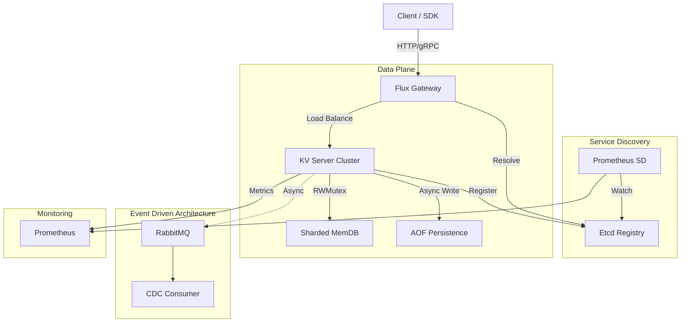
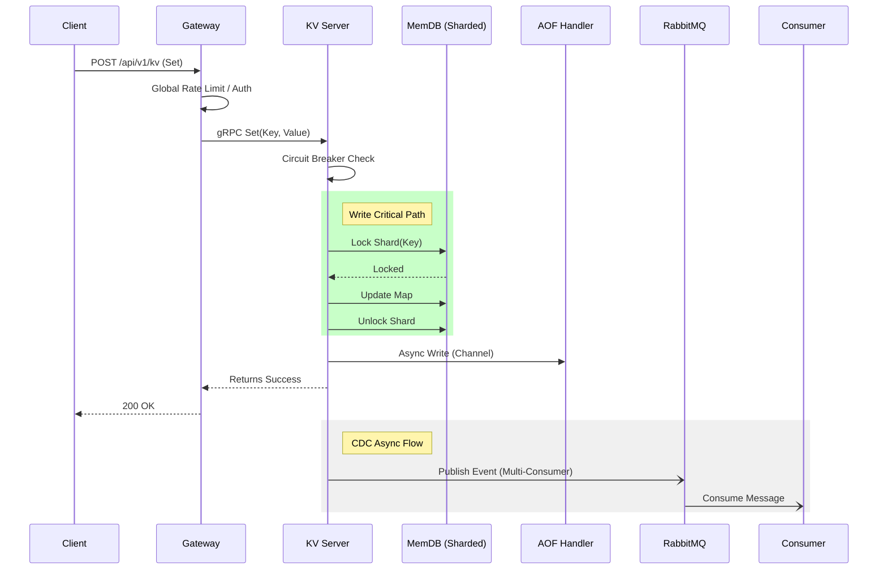

# Flux-KV (基于 Go 的高并发分布式键值存储系统)

这是一个高性能的分布式 KV 存储系统与微服务网关项目，集成了 Go 语言核心特性与云原生技术栈。

本项目旨在构建一个高并发、强一致性、工业级的分布式 KV 存储与网关系统。

## 🚀 功能特性

### 🏗️ 系统架构



### 🛣️ 核心写流程 (Set Sequence)



### 分布式 KV 存储
- **高性能存储**:
  - [x] 基于 sync.RWMutex 的基础存储
  - [x] **分片锁 (Sharded Map) 优化**: 256 分片，降低高并发写冲突
- **事件驱动架构**:
  - [x] **CDC (Change Data Capture)**: 实时数据变更流
  - [x] **RabbitMQ 集成**: 异步解耦与削峰填谷
  - [x] **多消费者并发**: 支持配置多个消费者协程，提高 CDC 吞吐量
- **持久化**: 支持 AOF (Append Only File) 持久化与启动恢复。
- **过期机制**: 实现 Lazy + Active 混合过期清理策略。
- **通信协议**: gRPC 接口支持，HTTP 网关泛化调用。
- **一致性**: 一致性哈希算法实现数据分片。

### 微服务网关
- **服务发现**: 集成 Etcd 实现动态服务注册与发现。
- **动态代理**: HTTP 转 gRPC 泛化调用。
- **高可用**:
  - 全局限流 (Token Bucket)
  - 熔断降级 (Hystrix)
  - 负载均衡 (RoundRobin / Consistent Hash)
  - 防缓存击穿 (SingleFlight)
- **工程化**:
  - [x] 优雅启停 (Graceful Shutdown)
  - [x] Docker Compose 全栈容器化编排
- **可观测性**:
  - [x] 集成 OpenTelemetry/Jaeger 链路追踪
  - [x] Prometheus 指标监控 + 服务发现

### 压测工具
- [x] **独立 Benchmark 工具**: 支持自定义并发数、总请求数
- [x] **服务发现集成**: 从 Etcd 动态获取节点
- **负载均衡测试**: 支持轮询和一致性哈希策略

## 🛠️ 快速开始

### 前置条件
- Go 1.22+
- Docker & Docker Compose

### 运行压测 (本地连接 Docker 容器)

```bash
# 构建
go build -o bin/benchmark cmd/benchmark/main.go

# 运行压测 (100 并发, 10 万请求)
./bin/benchmark -c 100 -n 100000

# 参数说明
# -c: 并发数 (Goroutines)
# -n: 总请求数
# -etcd: Etcd 地址 (默认 localhost:2379)
```

### 运行服务端 (KV Server)

```bash
# 本地运行
go run cmd/server/main.go

# 或使用 Docker
docker-compose up -d kv-server-1 kv-server-2 kv-server-3
```

### 运行网关 (Gateway)

```bash
go run cmd/gateway/main.go
```

## 🐳 Docker 快速部署 (推荐)

本项目支持 Docker Compose 一键拉起完整环境。
详细的操作指南请参考 [Docker 部署手册](docs/DOCKER.md)。

### 1. 构建并启动集群

```bash
docker-compose up --build -d
```

### 2. 查看节点状态

```bash
docker-compose ps
```

### 3. 操作验证

```bash
# 写入数据 (HTTP -> Gateway -> KV Node)
curl -X POST http://localhost:8080/api/v1/kv \
  -H "Content-Type: application/json" \
  -d '{"key":"hello","value":"world"}'

# 读取数据
curl "http://localhost:8080/api/v1/kv?key=hello"

# 验证 CDC 异步日志
docker logs -f flux-cdc-consumer
```

### 4. 访问管理后台

| 服务 | 地址 | 凭据 |
|------|------|------|
| Jaeger UI | http://localhost:16686 | - |
| RabbitMQ | http://localhost:15672 | fluxadmin / flux2026secure |
| Prometheus | http://localhost:9090 | - |
| Gateway | http://localhost:8080 | - |

## 📊 性能表现

我们针对系统的核心组件进行了严格的基准测试 (Benchmark)。

**核心指标:**

| 场景 | 并发 | 总请求 | 平均 QPS | 成功率 |
|------|------|--------|----------|--------|
| CDC Disabled | 100 | 500,000 | ~42,000 | 100% |
| CDC Enabled | 100 | 500,000 | ~32,000 | 100% |

> CDC 开启后性能损耗约 23%，主要用于 RabbitMQ 网络 I/O 和 JSON 序列化开销。

详细的压测数据和复现步骤请参阅 [性能测试报告](PERFORMANCE.md)。

## 📝 目录结构

```
├── api/                  # IDL 定义 (Proto/gRPC)
├── cmd/                  # 程序入口
│   ├── benchmark/        # 压测工具
│   ├── client/           # 测试客户端
│   ├── gateway/          # HTTP 网关
│   ├── server/           # KV 存储服务
│   ├── cdc_consumer/    # CDC 消费者
│   └── prometheus-sd/    # Prometheus 服务发现
├── configs/              # 配置文件
├── internal/             # 私有业务逻辑
│   ├── core/            # 存储引擎核心 (MemDB, Sharded Map)
│   ├── gateway/         # 网关核心逻辑
│   ├── aof/             # AOF 持久化
│   ├── event/           # 事件总线 (RabbitMQ)
│   └── service/         # gRPC 服务实现
├── pkg/                  # 公共库
│   ├── client/          # gRPC 客户端 (负载均衡)
│   ├── discovery/       # Etcd 服务发现
│   ├── consistent/       # 一致性哈希
│   └── metrics/         # Prometheus 指标
└── docs/                 # 文档
```
