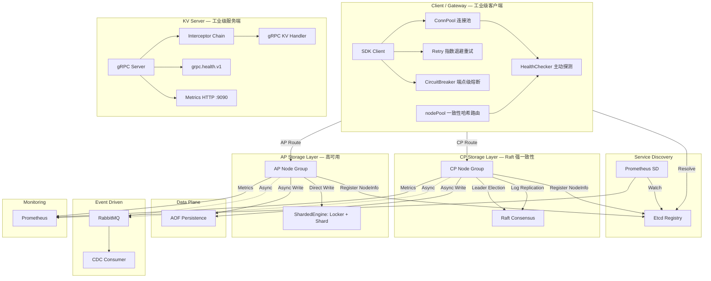
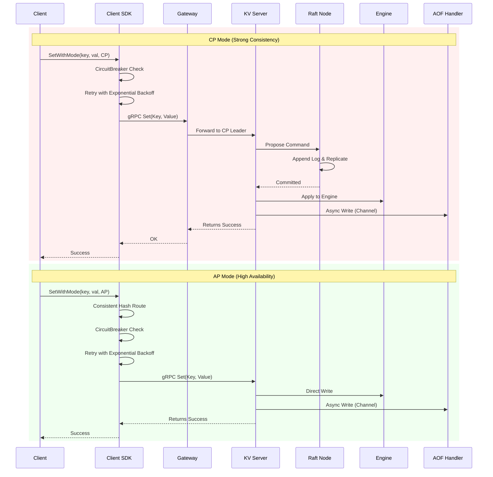

# Flux-KV (基于 Go 的高并发分布式键值存储系统)

这是一个高性能的分布式 KV 存储系统与微服务网关项目，集成了 Go 语言核心特性与云原生技术栈。

本项目旨在构建一个高并发、**CP/AP 可选一致性**、工业级的分布式 KV 存储与网关系统。

## 核心架构升级

- **存储引擎可插拔**: 抽象 `Engine` 接口，支持按 **Shard 类型**（`zerogc` 预分配零 GC / `map` 标准 map）× **锁类型**（`sharded` 细粒度 RWMutex / `global` 全局锁）× **分片数** 自由组合，无需硬编码引擎名称。
- **CP/AP 双模式共存**:
  - **CP 模式**: 基于自研简化 Raft 共识算法，保证线性一致性，适用于配置、元数据等强一致性场景。
  - **AP 模式**: 直接操作本地存储引擎，高可用低延迟，适用于缓存、会话等高性能场景。
- **Raft 生产化**: WAL 原子持久化（term+votedFor+log）、快照压缩（阈值触发 + 二进制格式）、ReadIndex 线性化读、Raft RPC 与业务 gRPC 共端口。
- **工业标准服务端包装**: 统一 `Server` 结构体封装 gRPC Server、Metrics HTTP、Health Check、Etcd 注册，支持分阶段优雅关闭（drain → graceful → force）。
- **工业标准客户端**: 连接池（生命周期管理）+ 主动健康探测（周期性 gRPC HealthCheck）+ 指数退避重试 + 端点级熔断器（Closed/Open/HalfOpen 状态机）。
- **统一网关路由**: 根据 Key 和一致性模式 (`?mode=cp|ap`) 自动路由到对应节点组，CP 写请求自动重定向到 Leader。
- **gRPC 拦截器链**: Request-ID（请求链跟踪）→ Recovery（panic 恢复）→ RateLimit（令牌桶限流）→ CircuitBreaker（熔断降级）→ Metrics（Prometheus 埋点）→ Logging（Zap 结构化日志采样）。
- **管理接口**: 静态查看节点状态、Raft 角色、引擎指标，支持集群拓扑可视化。

### 性能指标（真实 Benchmark）

| 场景 | 延迟 | 分配 |
|---|---|---|
| AP Set（ZeroGC + 256 Sharded）| ~32 ns/op | 40 B, 2 allocs |
| AP Get（ZeroGC + 256 Sharded）| ~19 ns/op | 64 B, 3 allocs |
| AP Set（Map + 256 Sharded）| ~30 ns/op | 88 B, 3 allocs |
| AP Get（Map + 256 Sharded）| ~14 ns/op | 40 B, 2 allocs |

> 完整数据见 [PERFORMANCE.md](PERFORMANCE.md)

---

## 功能特性

### 系统架构


```mermaid
graph TD
    subgraph ClientSide [Client / Gateway — 工业级客户端]
        ClientSDK[SDK Client]
        ConnPool[ConnPool 连接池]
        HealthChecker[HealthChecker 主动探测]
        Retry[Retry 指数退避重试]
        Breaker[CircuitBreaker 端点级熔断]
        NodePool[nodePool 一致性哈希路由]
        ClientSDK --> ConnPool
        ClientSDK --> Retry
        ClientSDK --> Breaker
        ConnPool --> HealthChecker
        NodePool --> HealthChecker
    end

    subgraph ServiceDiscovery [Service Discovery]
        Etcd[Etcd Registry]
        PrometheusSD[Prometheus SD]
    end

    ClientSide -- Resolve --> Etcd
    CPNodes -- Register NodeInfo --> Etcd
    APNodes -- Register NodeInfo --> Etcd
    PrometheusSD -- Watch --> Etcd

    subgraph ServerSide [KV Server — 工业级服务端]
        GRPC[gRPC Server]
        Interceptors[Interceptor Chain]
        HealthSvc[grpc.health.v1]
        KVHandler[gRPC KV Handler]
        MetricsSrv[Metrics HTTP :9090]

        GRPC --> Interceptors
        Interceptors --> KVHandler
        GRPC --> HealthSvc
        GRPC --> MetricsSrv
    end

    subgraph CP Layer [CP Storage Layer — Raft 强一致性]
        CPNodes[CP Node Group]
        Raft[Raft Consensus]
        CPNodes -->|Leader Election| Raft
        CPNodes -->|Log Replication| Raft
    end

    subgraph AP Layer [AP Storage Layer — 高可用]
        APNodes[AP Node Group]
        APNodes -->|Direct Write| APShards[ShardedEngine: Locker + Shard]
    end

    ClientSide -->|CP Route| CPNodes
    ClientSide -->|AP Route| APNodes

    subgraph DataPlane [Data Plane]
        CPNodes -->|Async Write| AOF[AOF Persistence]
        APNodes -->|Async Write| AOF
    end

    subgraph EventDriven [Event Driven]
        CPNodes -.->|Async| MQ[RabbitMQ]
        APNodes -.->|Async| MQ
        MQ --> Consumer[CDC Consumer]
    end

    subgraph Monitoring [Monitoring]
        CPNodes -->|Metrics| Prometheus[Prometheus]
        APNodes -->|Metrics| Prometheus
        PrometheusSD --> Prometheus
    end
```

### 核心写流程 (CP vs AP)


```mermaid
sequenceDiagram
    participant C as Client
    participant CL as Client SDK
    participant G as Gateway
    participant S as KV Server
    participant R as Raft Node
    participant DB as Engine
    participant AOF as AOF Handler

    rect rgb(255, 240, 240)
        note over C, AOF: CP Mode (Strong Consistency)
        C->>CL: SetWithMode(key, val, CP)
        CL->>CL: CircuitBreaker Check
        CL->>CL: Retry with Exponential Backoff
        CL->>G: gRPC Set(Key, Value)
        G->>S: Forward to CP Leader
        S->>R: Propose Command
        R->>R: Append Log & Replicate
        R-->>S: Committed
        S->>DB: Apply to Engine
        S->>AOF: Async Write (Channel)
        S-->>G: Returns Success
        G-->>CL: OK
        CL-->>C: Success
    end

    rect rgb(240, 255, 240)
        note over C, AOF: AP Mode (High Availability)
        C->>CL: SetWithMode(key, val, AP)
        CL->>CL: Consistent Hash Route
        CL->>CL: CircuitBreaker Check
        CL->>CL: Retry with Exponential Backoff
        CL->>S: gRPC Set(Key, Value)
        S->>DB: Direct Write
        S->>AOF: Async Write (Channel)
        S-->>CL: Returns Success
        CL-->>C: Success
    end
```

### 服务端工业标准特性

- **统一启动流程** (`cmd/server/main.go`):
  - 10 步启动：配置 → Tracer → 存储引擎 → CP/AP 模式选择 → gRPC Server → 拦截器链 → Metrics HTTP → Etcd 注册 → Migrator
  - 优雅关闭：gRPC GracefulStop → HTTP Shutdown → Migrator Stop → Etcd 注销
- **gRPC 拦截器链** (`internal/transport/grpc/kv_server.go`):
  - **RequestIDInterceptor**: 生成/透传 request-id
  - **RecoveryInterceptor**: panic 恢复
  - **RateLimitInterceptor**: 令牌桶限流
  - **CircuitBreakerInterceptor**: 熔断降级
  - **MetricsInterceptor**: Prometheus 指标统计
  - **LoggingInterceptor**: Zap 结构化日志（支持采样）
- **gRPC Health Check**: 注册 `grpc.health.v1` 服务
- **Readiness Probe**: `/ready` 检查 Etcd 连通性 + 存储初始化

### 客户端工业标准特性

- **连接池** (`pkg/network/client/pool.go`):
  - `PooledConn` 包装 `grpc.ClientConn`，跟踪 `createdAt` 和 `lastUsed`
  - 支持 max idle (30s) 和 max age (5min) 淘汰
  - 后台 goroutine 定期清理过期连接
- **主动健康探测** (`pkg/network/client/health.go`):
  - 周期性（默认 5s）向每个端点发送 gRPC `HealthCheck` RPC
  - 独立健康状态机：`Healthy` / `Unhealthy` / `Probing`
  - 连续 2 次失败标记为不健康，连续 1 次成功恢复为健康
- **指数退避重试** (`pkg/network/client/retry.go`):
  - `RetryPolicy`: 最大 3 次重试，100ms 基础延迟，2x 乘数，最大 2s
  - 仅对可重试错误重试：`Unavailable`、`DeadlineExceeded`、`ResourceExhausted`
  - 带抖动（jitter）避免重试风暴
- **端点级熔断器** (`pkg/network/client/breaker.go`):
  - 每个后端节点独立 `CircuitBreaker`（Closed / Open / HalfOpen）
  - 连续 5 次失败进入 Open 状态，30s 后进入 HalfOpen 试探
  - HalfOpen 状态下连续 2 次成功恢复为 Closed
- **负载均衡增强**:
  - **AP 模式**: 一致性哈希选择节点 → 健康过滤 → 健康节点轮询 fallback
  - **CP 模式**: 优先选择健康 Leader → Leader 不健康时 fallback 到健康 Follower

### 分布式 KV 存储

- **可插拔存储引擎**（按维度自由组合）:
  - **Shard 类型**: `zerogc`（预分配零 GC）/ `map`（标准 map）
  - **锁类型**: `sharded`（256 把 RWMutex）/ `global`（全局锁）
  - **分片数**: 可配置，默认 256（2^8）
  - `Engine` 统一接口：`Get` / `Set` / `Delete` / `Stats` / `Close`
- **Raft 强一致性**:
  - [x] 自研简化 Raft：Leader 选举、日志复制、Apply Loop
  - [x] gRPC 传输层：节点间 `RequestVote` / `AppendEntries` 通信
  - [x] CP 组内自动 Leader 选举与故障转移
  - [x] Leader 变更自动重定向（客户端缓存 + 重试）
- **事件驱动架构**:
  - [x] **CDC (Change Data Capture)**: 实时数据变更流
  - [x] **RabbitMQ 集成**: 异步解耦与削峰填谷
  - [x] **多消费者并发**: 支持配置多个消费者协程，提高 CDC 吞吐量
- **持久化**: 支持 AOF (Append Only File) 持久化与启动恢复。
- **过期机制**: 实现 Lazy + Active 混合过期清理策略。//基于存储引擎实现
- **通信协议**: gRPC 接口支持，HTTP 网关泛化调用。

### 微服务网关

- **服务发现**: 集成 Etcd 实现动态服务注册与发现，支持 CP/AP 节点分组与 Leader 状态。
- **一致性模式路由**: 根据 `?mode=cp|ap` 参数自动选择 CP 或 AP 节点组。
- **高可用**:
  - 全局限流 (Token Bucket)
  - 熔断降级 (Hystrix)
  - 负载均衡 (Consistent Hash for AP, Leader-aware for CP)
  - 防缓存击穿 (SingleFlight)
- **工程化**:
  - [x] 优雅启停 (Graceful Shutdown)
  - [x] Docker Compose 全栈容器化编排
- **可观测性**:
  - [x] 集成 OpenTelemetry/Jaeger 链路追踪
  - [x] Prometheus 指标监控 + 服务发现
  - [x] Raft 专属指标：`raft_role`, `raft_commit_index`, `raft_healthy_nodes`

### 管理接口

- [x] **集群拓扑**: `GET /admin/nodes` 查看所有注册节点及模式
- [x] **节点状态**: `GET /admin/nodes/:addr/status` 查看指定节点的引擎 Stats 和 Raft 状态
- [x] **集群统计**: `GET /admin/stats` 汇总所有节点状态

### 压测工具

- [x] **独立 Benchmark 工具**: `cmd/benchmark/`，支持自定义并发数、总请求数、一致性模式、操作混合
- [x] **服务发现集成**: 从 Etcd 动态获取节点，自动使用连接池、健康探测、重试、熔断
- [x] **操作混合模式**: 支持纯 Set / Get / Del 或混合读写比例测试

### 交互式客户端

- [x] **REPL 命令行客户端**: `cmd/client/`，支持 SET / GET / DEL / 模式切换
- [x] **工业级 Client 集成**: 自动使用连接池、健康探测、重试、熔断

### 无感扩容机制
- [x] **双环读回退**: 节点变更时维护 activeRing + prevRing，fallback 读取避免 miss
- [x] **Push 数据迁移**: 新增 `InternalSet` RPC 实现节点间数据迁移
- [x] **后台迁移器**: 定时扫描本地缓存，将属于新节点的 key Push 过去

---

## 快速开始

### 前置条件

- Go 1.24+
- Docker & Docker Compose

### Docker 一键部署 (推荐)

```bash
# 构建并启动完整集群
docker-compose up --build -d

# 等待约 20 秒，所有服务就绪
docker-compose ps
```

**集群组成**:
- **基础设施**: Etcd, RabbitMQ, Jaeger, Prometheus
- **CP 存储层**: 3 个 Raft 节点 (`cp-node-1`, `cp-node-2`, `cp-node-3`)
- **AP 存储层**: 2 个高可用节点 (`ap-node-1`, `ap-node-2`)
- **网关层**: 2 个 Gateway 实例 (`gateway-1`, `gateway-2`)
- **数据流层**: CDC Consumer

### 操作验证

```bash
# === AP 模式 (默认): 高可用低延迟 ===
curl -X POST http://localhost:8080/api/v1/kv \
  -H "Content-Type: application/json" \
  -d '{"key":"ap-key","value":"hello-ap"}'

curl "http://localhost:8080/api/v1/kv?key=ap-key"
# {"key":"ap-key","value":"hello-ap","mode":"ap"}

# === CP 模式: 强一致性 (通过 Raft) ===
curl -X POST http://localhost:8080/api/v1/kv?mode=cp \
  -H "Content-Type: application/json" \
  -d '{"key":"cp-key","value":"hello-cp"}'

curl "http://localhost:8080/api/v1/kv?key=cp-key&mode=cp"
# {"key":"cp-key","value":"hello-cp","mode":"cp"}

# === 管理接口 ===
curl http://localhost:8080/admin/nodes
curl http://localhost:8080/admin/stats

# === 验证 CDC 异步日志 ===
docker logs -f flux-cdc-consumer
```

### 本地启动单个节点

```bash
# 启动服务端（AP 模式）
go run cmd/server/main.go -port 50052

# 启动网关
go run cmd/gateway/main.go

# 使用交互式客户端
go run cmd/client/main.go

# 运行压测
go run cmd/benchmark/main.go -c 100 -n 500000 -mode ap -op mixed
```

### 访问管理后台

| 服务 | 地址 | 凭据 |
|------|------|------|
| Jaeger UI | http://localhost:16686 | - |
| RabbitMQ | http://localhost:15672 | 见 `.env` 配置 |
| Prometheus | http://localhost:9090 | - |
| Gateway | http://localhost:8080 | - |

---

## 性能表现

我们针对系统的核心组件进行了严格的基准测试 (Benchmark)。

**核心指标**:

| 场景 | 并发 | 总请求 | 平均 QPS | 成功率 |
|------|------|--------|----------|--------|
| AP Set (ZeroGC+Sharded, 256) | 32 | — | ~3.1M ops/s | 100% |
| AP Get (Map+Sharded, 256) | 32 | — | ~7.1M ops/s | 100% |
| CP Mode (Raft) | 100 | 100,000 | ~8,000 | 100% |

> AP 模式按 1s / 32ns ≈ 31M ops/s 理论峰值（实际受网络和序列化限制）。
> CP 模式因 Raft 日志复制和共识开销，QPS 低于 AP 模式，但保证了线性一致性。
> 详细的 ShardedEngine 微基准测试见 [PERFORMANCE.md](PERFORMANCE.md)。

---

## 目录结构

```
├── api/                        # IDL 定义 (Proto/gRPC)
│   └── proto/
│       ├── kv.proto            # KV 服务 + Status/RaftInfo RPC
│       └── raft/
│           └── raft.proto      # Raft 节点间通信协议
├── cmd/                        # 程序入口
│   ├── benchmark/              # 压测工具
│   ├── client/                 # 交互式 CLI 客户端
│   ├── gateway/                # HTTP/gRPC 网关
│   ├── server/                 # KV 存储服务
│   ├── cdc_consumer/           # CDC 消费者
│   └── prometheus-sd/          # Prometheus 服务发现
├── configs/                    # 配置文件
│   ├── config.yaml             # 服务端配置
│   └── prometheus.yaml         # Prometheus 配置
├── internal/                   # 私有业务逻辑
│   ├── app/                    # 应用层 (UseCase + NodeMeta + Migrator)
│   ├── config/                 # 配置解析
│   ├── event/                  # 事件总线 (RabbitMQ)
│   ├── network/
│   │   └── gateway/            # 网关层
│   │       ├── admin/          # Admin HTTP 接口
│   │       ├── transport/      # gRPC 传输
│   │       └── client.go       # Gateway 后端客户端
│   ├── raft/                   # Raft 共识实现
│   ├── storage/                # 存储引擎
│   │   ├── core/               # ZeroGCShard / MapShard
│   │   ├── shard/              # Shard 接口
│   │   ├── locker/             # Locker 接口
│   │   ├── aof/                # AOF 批量持久化
│   │   ├── engine.go           # Engine 接口
│   │   ├── factory.go          # 引擎工厂 (按维度组合)
│   │   ├── sharded_engine.go   # 统一分片引擎
│   │   ├── ap_storage.go       # AP 模式包装
│   │   └── cp_storage.go       # CP 模式包装 (Raft)
│   └── transport/
│       └── grpc/               # gRPC KV Server 实现
├── pkg/                        # 公共库
│   ├── consistent/             # 一致性哈希
│   ├── logger/                 # Zap 日志 (支持采样)
│   ├── metrics/                # Prometheus 指标
│   ├── resilience/             # 弹性组件 (限流器/熔断器)
│   └── network/
│       ├── client/             # gRPC 客户端 SDK
│       │   ├── balancer/       # 负载均衡器
│       │   ├── picker/         # 一致性哈希选择器
│       │   ├── resolver/       # Etcd 服务解析器
│       │   └── interceptors/   # 客户端拦截器
│       ├── discovery/          # Etcd 注册/发现
│       └── tracer/             # OpenTelemetry 链路追踪
├── scripts/                    # 运维脚本
├── docs/                       # 技术文档
│   ├── API.md
│   ├── ARCHITECTURE.md
│   ├── DOCKER.md
│   └── superpowers/            # 技术深度文章
├── docker-compose.yaml
├── PERFORMANCE.md              # 性能基准数据
└── README.md
```

---

## 相关文档

- [API 接口文档](docs/API.md) — HTTP API 详细说明，包含 CP/AP 模式和管理接口
- [Docker 部署指南](docs/DOCKER.md) — 容器化部署、环境变量、故障排查
- [性能测试报告](PERFORMANCE.md) — 压测数据与复现步骤
- [技术深度文章](docs/superpowers/) — 分片并发优化、AOF 持久化、Raft 治理、工业标准交互架构

---

**最后更新**: 2026-05-23
